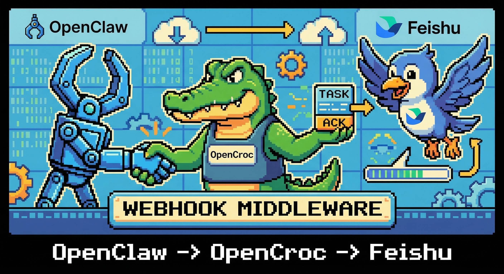
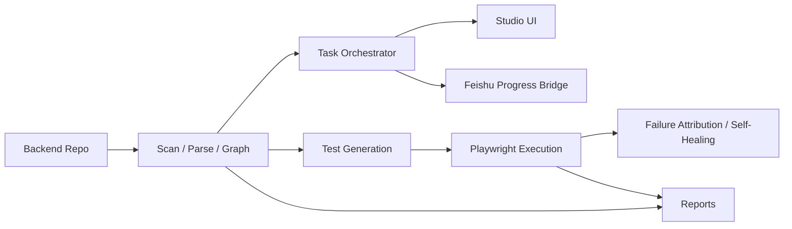

<p align="center">
  
</p>

<h1 align="center">OpenClaw Feishu Progress</h1>

<p align="center">
  <strong>把 OpenClaw 的复杂飞书请求转成可追踪任务，并把 ACK、阶段进度和完成结果稳定回传到飞书。</strong>
</p>

<p align="center">
  <a href="https://github.com/opencroc/openclaw-feishu-progress/actions/workflows/ci.yml"></a>
  <a href="https://github.com/opencroc/openclaw-feishu-progress/blob/main/LICENSE"></a>
  <a href="https://github.com/opencroc/openclaw-feishu-progress"></a>
</p>

---

## 一句话价值

OpenClaw Feishu Progress 把“飞书收到复杂请求、快速 ACK、按阶段回进度、最终回结果”收进一条稳定链路，优先解决聊天场景里的长任务可见性问题。

## 核心特性

- OpenClaw 本机转发桥：把飞书私聊中的复杂请求先转到本机任务服务，再决定是否由 OpenClaw 自己回退回复
- 飞书 ACK 与进度回传：支持任务开始、阶段进度、等待确认、完成、失败等消息类型
- 同任务串行投递：避免并发发送导致的进度乱序
- 本地任务化执行：把复杂对话请求变成带阶段、摘要和历史事件的可追踪任务
- analysis 直出完成态：常见“这个项目是干什么的”类请求不再卡在等待确认
- systemd 常驻运行：适合部署在 Linux 服务器上，配合飞书机器人长期运行
- 可视化状态页：保留本地 Web 界面查看任务、图谱和运行状态

## 5 分钟快速开始

### 前置要求

- Node.js 18+
- 一台 Linux 服务器
- 一个可用的 OpenClaw 网关实例
- 一组可用的飞书机器人凭据

### 1) 安装

```bash
git clone git@github.com:opencroc/openclaw-feishu-progress.git
cd openclaw-feishu-progress
npm install
```

### 2) 初始化配置

复制或编辑本地运行配置：

```bash
cp .env.example .env
```

然后填写 `.env` 中的飞书参数和访问地址。

### 3) 先确认配置

先确认飞书配置和回传地址：

```bash
cat .env
```

### 4) 启动 Studio

开发态直启：

```bash
npm run serve:dev -- --host 0.0.0.0 --port 8765 --no-open
```

前后端分离开发（前端热更新）：

```bash
npm run dev
```

这会同时启动：

- 前端 Vite HMR：`http://localhost:5173`
- 后端 API / WebSocket：`http://127.0.0.1:8765`

生产态构建后启动：

```bash
npm run build
node dist/cli/index.js serve --host 0.0.0.0 --port 8765 --no-open
```

本机打开 `http://127.0.0.1:8765`，查看任务和运行状态。

### 5) 跑一次真实飞书 smoke

```bash
curl -X POST http://127.0.0.1:8765/api/feishu/smoke/progress \
  -H 'content-type: application/json' \
  -d '{
    "chatId": "oc_xxx",
    "requestId": "om_xxx",
    "title": "Smoke test from OpenClaw Feishu Progress"
  }'
```

跑完后，你应该能看到：

- 飞书立即收到 ACK
- 飞书持续收到阶段进度
- 飞书收到最终完成消息

如果你要补完整 DoD 闭环，再跑一次 failed smoke：

```bash
curl -X POST http://127.0.0.1:8765/api/feishu/smoke/progress \
  -H 'content-type: application/json' \
  -d '{
    "chatId": "oc_xxx",
    "requestId": "om_xxx",
    "title": "Smoke failed from OpenClaw Feishu Progress",
    "outcome": "failed",
    "failureMessage": "Smoke failed after staged progress"
  }'
```

完整的鉴权、部署和验收步骤见 [docs/feishu-auth-deployment.md](docs/feishu-auth-deployment.md)。

## 一个真实 Demo

### Demo：飞书实时进度 smoke 测试

如果你现在最关心的是“飞书里的任务进度能不能稳定回传”，先跑这条最短路径。

最小配置：

```ts
import { defineConfig } from './dist/index.js';

export default defineConfig({
  backendRoot: './backend',
  feishu: {
    enabled: true,
    mode: 'live',
    messageFormat: 'text',
    appId: process.env.FEISHU_APP_ID,
    appSecret: process.env.FEISHU_APP_SECRET,
    webhookVerificationToken: process.env.FEISHU_WEBHOOK_VERIFICATION_TOKEN,
    webhookEncryptKey: process.env.FEISHU_WEBHOOK_ENCRYPT_KEY,
    webhookMaxSkewSeconds: 300,
    webhookDedupTtlSeconds: 600,
    relaySecret: process.env.OPENCLAW_RELAY_SECRET,
    relayMaxSkewSeconds: 300,
    relayNonceTtlSeconds: 600,
    deliveryMaxRetries: 2,
    deliveryRetryBaseMs: 300,
    deliveryRetryMaxMs: 5000,
    baseTaskUrl: process.env.OPENCLAW_FEISHU_PROGRESS_BASE_TASK_URL ?? 'http://127.0.0.1:8765',
    progressThrottlePercent: 15,
  },
});
```

如果配置了 `feishu.relaySecret`，OpenClaw 调用 `/api/feishu/relay` 与 `/api/feishu/relay/event` 时必须附带：

- `x-openclaw-timestamp`
- `x-openclaw-nonce`
- `x-openclaw-signature`

签名内容为 `METHOD + path + timestamp + nonce + stable JSON body` 的 HMAC-SHA256。

如果配置了 `feishu.webhookEncryptKey`，飞书事件订阅调用 `/api/feishu/webhook` 时会校验：

- `x-lark-request-timestamp`
- `x-lark-request-nonce`
- `x-lark-signature`

如果同时配置了 `feishu.webhookVerificationToken`，还会校验回调体中的 token。事件去重状态会持久化到 `.opencroc/feishu-webhook-dedup.json`，这样服务重启后 TTL 内的重复投递仍会被拦截。

出站发消息与卡片更新默认会对 `429/5xx/网络错误` 做有限次指数退避重试，可用 `deliveryMaxRetries`、`deliveryRetryBaseMs`、`deliveryRetryMaxMs` 调整。

启动服务：

开发态直启：

```bash
npm run serve:dev -- --host 0.0.0.0 --port 8765 --no-open
```

前端热更新开发：

```bash
npm run dev
```

或者先构建再启动：

```bash
node dist/cli/index.js serve --host 0.0.0.0 --port 8765 --no-open
```

触发 smoke：

```bash
curl -X POST http://127.0.0.1:8765/api/feishu/smoke/progress \
  -H 'content-type: application/json' \
  -d '{
    "chatId": "oc_xxx",
    "requestId": "om_xxx",
    "title": "Smoke test from local OpenClaw Feishu Progress"
  }'
```

预期结果：

1. 立即收到 ACK / 任务开始消息
2. 收到多次阶段进度更新
3. 收到最终完成消息

如果这条 smoke 流程可用，说明 OpenClaw Feishu Progress 的飞书出站回传链路已经打通，可以继续接真实复杂请求。

## 架构图



OpenClaw Feishu Progress 当前可以理解成 5 层：

- Ingest：扫描源码、模型、控制器、DTO 和关系
- Understand：构建知识图谱和任务可用的项目上下文
- Orchestrate：把分析结果组织成可执行任务和阶段进度
- Execute：生成测试、执行、观测失败并做受控修复
- Surface：通过 Studio、报告和飞书把结果呈现出来

## 场景示例

- 飞书机器人复杂请求：先回 ACK，再按阶段把处理进度推回飞书
- OpenClaw 兜底接管：复杂请求转本机任务服务，简单请求仍可由 OpenClaw 原链路处理
- 线上长任务可见化：减少“机器人没反应”和“用户重复追问”的体验问题
- 联调排障：在本地 Web 页和 systemd/journal 里同时看任务和服务状态
- 独立开源部署：把这条链路单独维护，而不是依附在原始大项目分支里

## 跟竞品对比

| 维度 | OpenClaw Feishu Progress | 直接让 OpenClaw 回长答案 | 手写飞书机器人脚本 | 通用任务系统 |
| --- | --- | --- | --- | --- |
| 飞书复杂请求转任务 | 内建 | 没有 | 手工维护 | 部分具备 |
| ACK 与阶段进度回传 | 内建 | 没有 | 手工维护 | 取决于实现 |
| 乱序控制 | 内建串行投递 | 无 | 自己处理 | 取决于实现 |
| OpenClaw 本机桥接 | 内建 | 无 | 手工集成 | 通常没有 |
| Linux 常驻部署 | 直接支持 | 取决于脚本 | 可做但零散 | 一般支持 |
| 最适合谁 | 想把 OpenClaw + 飞书进度打通的团队 | 只要简单问答的团队 | 愿意手写所有桥接逻辑的团队 | 已有成熟任务平台的团队 |

## Roadmap

- 当前：OpenClaw 转发、飞书 ACK/阶段进度、done/failed smoke、webhook/relay 鉴权去重、analysis 完成态与 Studio UI 已可用
- 下一步：飞书卡片交互与 waiting 决策流、Topic 可观测、systemd/Docker 生产交付物补齐
- 同期：OpenCroc 的 scan/graph + pipeline（生成/执行/自愈/报告）持续补强，确保任务“真的跑完并可交付”
- 详细 Sprint 计划与 DoD：见 [docs/roadmap.md](docs/roadmap.md)

## 更多文档

- [架构说明](docs/architecture.md)
- [飞书鉴权与部署](docs/feishu-auth-deployment.md)
- [配置参考](docs/configuration.md)
- [Roadmap（Sprint 计划）](docs/roadmap.md)
- [后端埋点指南](docs/backend-instrumentation.md)
- [AI Provider 配置](docs/ai-providers.md)
- [自愈机制说明](docs/self-healing.md)
- [故障排查](docs/troubleshooting.md)

## License

[MIT](LICENSE) Copyright 2026 OpenClaw Feishu Progress Contributors
